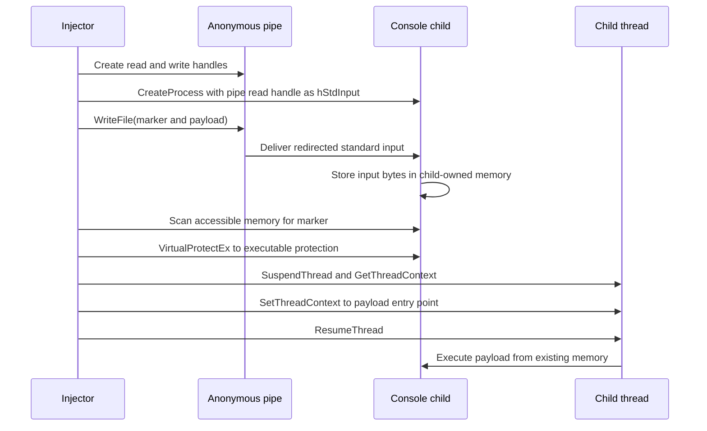

## Executive Summary

Security researcher Two Seven One Three disclosed a Windows process injection
proof of concept (PoC) called `InjectSetConsole` on September 26, 2026. The
technique creates an interactive console child such as `nslookup.exe` or
`netsh.exe`, redirects the child's standard input to a pipe, and sends a marker
and payload through `WriteFile`. Normal console input processing places those
bytes in memory owned by the child. The injector locates the marker, changes
the existing memory pages to executable with `VirtualProtectEx`, redirects an
existing thread's instruction pointer, and resumes execution.

The technique is significant because it omits two APIs commonly associated
with remote process injection: `VirtualAllocEx` and `WriteProcessMemory`. It
does not eliminate the broader behavioral chain. Process creation with
redirected handles, cross-process memory inspection, remote protection
changes, thread suspension, thread-context modification, and execution from
private memory remain potential detection points.

Available evidence supports high confidence that the public PoC demonstrates
the mechanism described by its author. Confidence is medium that it operates
reliably across general Windows environments and low that it broadly evades
EDR products. The researcher did not publish product-specific test results.
Testing against four EDR products cited in adjacent reporting concerns a
separate Process Parameter Poisoning technique and does not validate
`InjectSetConsole`.

No malware campaign, threat actor deployment, victim set, or in-the-wild use
was identified in the reviewed sources. Defenders should treat this as an
emerging tradecraft and detection-engineering scenario, not as evidence of an
active campaign.

## Research Scope and Analytical Guardrails

Research covers public information available through September 28, 2026. The
primary evidence is the researcher's technical article and public C++ PoC.

No execution or EDR validation was performed for this report. Telemetry
availability depends on sensor versions, endpoint configuration, audit policy,
connector settings, and retention. Exact tables, columns, and action types must
be checked against the target environment before deploying analytics.

## Technique Overview

Classic remote process injection often follows an allocate, write, and execute
sequence:

```text
Open or create target
  -> VirtualAllocEx
  -> WriteProcessMemory
  -> CreateRemoteThread or thread hijacking
```

Console named-pipe injection replaces the explicit remote allocation and write
steps with console input handling:

```text
CreatePipe
  -> CreateProcess with redirected hStdInput
  -> WriteFile to the pipe
  -> Child stores input bytes in its own memory
  -> Locate marker in child memory
  -> VirtualProtectEx on the existing pages
  -> Suspend and modify an existing thread
  -> Resume execution at the payload
```

The technique does not qualify as process hollowing based on the published
implementation. It does not require a suspended child at creation, unmap the
original image, or replace the executable image. The closest ATT&CK
sub-technique is Thread Execution Hijacking because control flow is redirected
by changing an existing thread context.

## Technical Execution Flow



### Pipe and process creation

The injector creates a pipe and makes the read handle inheritable. It assigns
that handle to `STARTUPINFO.hStdInput`, enables `STARTF_USESTDHANDLES`, and
creates an interactive console child with handle inheritance. The injector
retains the write end. Microsoft documents this parent-child redirection
pattern for anonymous pipes.

Windows implements anonymous pipes through the named-pipe mechanism with a
unique system-generated name. The research article therefore calls the method
console named-pipe injection even though the PoC creates the channel with
`CreatePipe` rather than a caller-selected name.

### Payload placement

The injector calls `WriteFile` on the pipe's write handle. As the console
program processes standard input, the supplied bytes appear in memory owned by
the child. This avoids an explicit `WriteProcessMemory` call from the injector.

The published technique prefixes the payload with a distinctive marker and
searches accessible child memory for that byte sequence. The entry point is
calculated after the marker. This is a discovery mechanism, not a stable
indicator: an operator can change the marker, and the repository explicitly
suggests doing so.

The author identifies three restricted bytes because the console can interpret
them as input controls:

| Byte | Meaning | Potential effect |
|------|---------|------------------|
| `0x0D` | Carriage return | Terminates or submits console input |
| `0x0A` | Line feed | Terminates a line |
| `0x1A` | Substitute or Ctrl+Z | Can act as an end-of-file marker |

### Memory protection and control-flow transfer

Input bytes initially reside in non-executable memory. The injector uses
`VirtualProtectEx` to grant execute permission to the committed pages that
contain the payload. It then suspends a child thread, retrieves its context,
sets the instruction pointer to the payload, and resumes the thread.

The sequence avoids `CreateRemoteThread`, but it still crosses process and
thread security boundaries. `VirtualProtectEx` requires
`PROCESS_VM_OPERATION`. Thread-context operations require suitable thread
access rights. These operations may be blocked by integrity boundaries,
protected-process controls, endpoint prevention, or other access restrictions.

Microsoft documents that code placed in newly executable memory should have
instruction-cache coherency maintained, normally through
`FlushInstructionCache`. Whether every PoC path handles this requirement and
how omission affects reliability require independent runtime testing.

## Windows Mechanisms and Detection Relevance

| API or mechanism | Role in the PoC | Detection relevance |
|------------------|-----------------|---------------------|
| `CreatePipe` | Creates the redirected standard-input channel | Pipe creation and inherited-handle context may be observable |
| `STARTUPINFO.hStdInput` | Assigns the pipe read handle to the child | Unusual standard-handle redirection strengthens process-tree context |
| `CreateProcess` | Starts the interactive console child | Parent-child rarity, command line, integrity, and timing are useful pivots |
| `WriteFile` | Sends marker and payload to the child | Raw pipe writes require handle-level or endpoint telemetry to distinguish |
| `VirtualQueryEx` or equivalent | Enumerates candidate child memory | Cross-process query behavior can contribute to a sequence-based analytic |
| `ReadProcessMemory` or equivalent | Searches remote memory for the marker | Remote reads may be visible as process-access behavior |
| `VirtualProtectEx` | Makes the existing pages executable | Remote writable-to-executable transitions are high-value signals |
| `SuspendThread` | Pauses the selected child thread | Useful when correlated with process creation and memory changes |
| `GetThreadContext` and `SetThreadContext` | Redirect the instruction pointer | Strong control-flow manipulation signal where telemetry exists |
| `ResumeThread` | Starts execution at the payload | Completes the behavioral sequence |

The public sources do not establish that each API is exposed as a discrete
Microsoft Defender XDR Advanced Hunting event. API-level visibility may
instead come from endpoint behavioral detections, ETW, Sysmon, specialized EDR
telemetry, or controlled instrumentation.

## Prerequisites and Limitations

The method has practical constraints that narrow its viable target set:

* The target must be an interactive console program that accepts redirected
  standard input and retains the supplied bytes in accessible memory.
* The injector needs process and thread handles with rights sufficient for
  memory queries, protection changes, suspension, and context modification.
* The payload must avoid console-sensitive bytes or use an encoding or decoder
  that satisfies the same input restrictions.
* Marker-based discovery can fail if input is transformed, fragmented,
  consumed, moved, truncated, or overwritten.
* Payload execution can crash the child if register state, stack alignment,
  calling convention, architecture, or memory protection is incompatible.
* Protected Process Light, integrity-level boundaries, session isolation,
  architecture differences, and endpoint self-protection may prevent access.
* Reliability across Windows client and server builds, x86, WOW64, ARM64,
  pseudoconsole environments, and noninteractive sessions is not established.
* The PoC documents `netsh.exe` and `nslookup.exe`; it does not prove that all
  console programs are suitable targets.

The public repository is a compact C++ PoC with no published release. It is
research tooling, not evidence of production-quality offensive capability.

## EDR Evasion Assessment

### What the evidence establishes

The PoC omits `VirtualAllocEx` and `WriteProcessMemory`. It also avoids creating
the child in a suspended state and does not require unusual command-line or
environment formatting. These properties can defeat detections that depend
only on one classic API pair or a fixed allocate-write-execute sequence.

The researcher demonstrates bytes placed in `nslookup.exe`, a remote memory
protection change, and redirection of the main thread. The source repository
and demo video provide artifacts for independent reproduction.

### What the evidence does not establish

The evidence does not show broad EDR bypass. The author states that no personal
EDR test results are included. The reference to earlier researchers testing
several EDR products points to SensePost's separate Process Parameter
Poisoning work. That technique uses process startup parameters and has a
different implementation and detection surface.

Avoiding two APIs does not suppress the full behavioral sequence. Modern
endpoint products may detect suspicious child creation, remote process access,
executable private memory, remote protection changes, thread-context
manipulation, anomalous control flow, or payload behavior after execution.

The most accurate conclusion is that console named-pipe injection creates a
visibility gap for narrow, API-centric detections. Product-specific evasion
remains unverified until tested against named products, versions, policies,
and sensor configurations.

## MITRE ATT&CK Mapping

| Tactic | Technique | Confidence | Rationale |
|--------|-----------|------------|-----------|
| Defense Evasion | [T1055 Process Injection](https://attack.mitre.org/techniques/T1055/) | High | Arbitrary code executes inside another process |
| Defense Evasion | [T1055.003 Thread Execution Hijacking](https://attack.mitre.org/techniques/T1055/003/) | High | An existing thread context is modified to redirect execution |

`T1055.012 Process Hollowing` is not supported by the published behavior. The
child image remains mapped and is not replaced. Named-pipe techniques related
to remote services, impersonation, or lateral movement are also unsupported:
the pipe is a local payload transport between parent and child.

## Detection and Hunting Opportunities

Detection should correlate several weak and strong signals. Alerting on every
`nslookup.exe`, `netsh.exe`, console process, pipe operation, or memory query
would produce substantial noise.

### Microsoft Defender XDR

Use `DeviceProcessEvents` to identify and enrich unusual console-child
creation:

* Rare parents launching `nslookup.exe`, `netsh.exe`, or other interactive
  console programs without a plausible administrative or diagnostic purpose
* Console children with unusual command lines, integrity relationships,
  execution accounts, timing, or short lifetimes
* Unexpected payload behavior attributed to the child, including follow-on
  process creation, network connections, persistence, discovery, or credential
  access

Use `DeviceNetworkEvents`, `DeviceFileEvents`, `DeviceRegistryEvents`, and
`DeviceImageLoadEvents` as post-execution pivots when the injected payload
performs observable activity. These tables do not prove injection by
themselves. Correlate them to the process identity and creation window.

Use `DeviceEvents` only after confirming relevant `ActionType` values in the
tenant. Do not assume direct records exist for `VirtualProtectEx`,
`SetThreadContext`, anonymous-pipe writes, or arbitrary memory scanning.

### Sysmon and Microsoft Sentinel

Where Sysmon data is collected into Sentinel, evaluate these events as
correlation inputs:

| Sysmon event | Use | Limitation |
|--------------|-----|------------|
| Event ID 1, Process Create | Establish the parent-child relationship and command line | Does not expose redirected handle contents by itself |
| Event ID 3, Network Connection | Identify follow-on network behavior | Requires network event collection and can be noisy |
| Event ID 7, Image Load | Find unusual modules loaded after child creation | Shellcode execution may not load a new image |
| Event ID 8, CreateRemoteThread | Useful negative or adjacent signal | The published technique hijacks an existing thread |
| Event ID 10, Process Access | Identify suspicious cross-process handle access | Access masks require environment-specific tuning |
| Event IDs 17 and 18, Pipe Create and Connect | Add pipe context where captured | Anonymous standard-input coverage must be lab-validated |
| Event ID 25, Process Tampering | Add applicable process-manipulation context | Coverage of this exact technique is not established |

Microsoft documents anonymous pipes as uniquely named pipes internally, but
that does not prove Sysmon will emit complete creation, connection, or content
telemetry for this PoC. Validate the deployed Sysmon version and configuration
in a lab before relying on pipe events.

### High-value hunting hypotheses

1. A rare parent creates an interactive console child and quickly obtains
   process or thread access to that same child.
2. A newly created console process experiences a remote writable-to-executable
   memory protection change followed by thread-context manipulation.
3. A console child with no normal interactive use emits parsing errors,
   terminates unexpectedly, or begins behavior inconsistent with its command
   line.
4. `nslookup.exe`, `netsh.exe`, or another console utility performs unexpected
   file, registry, process, credential, or network activity shortly after a
   suspicious parent launches it.
5. Endpoint telemetry shows remote memory reads or scanning against a new child
   followed by executable private-memory activity.
6. A process tree contains a console utility with weak command-line rationale,
   no expected operator context, and behavior attributable to an injected
   payload.

The second hypothesis is the most specific but requires telemetry that may not
be available in native Advanced Hunting tables. The fourth hypothesis is less
specific but can be investigated with standard Defender XDR process and
behavioral telemetry.

## Mitigation and Response Guidance

Preventive and detective controls should focus on the remaining behavior rather
than the missing APIs:

* Keep endpoint behavioral protection, cloud-delivered protection, and
  tamper-protection capabilities enabled and current.
* Apply least privilege and tightly control `SeDebugPrivilege` and local
  administrative access.
* Use application control, Attack Surface Reduction rules, and exploit
  protection where compatible with business requirements.
* Protect high-value processes with supported Windows security boundaries such
  as Protected Process Light where applicable.
* Baseline legitimate automation that launches console utilities with
  redirected standard handles.
* Monitor remote memory-protection changes, executable private memory, and
  thread-context manipulation when endpoint tooling exposes these signals.
* Correlate process, pipe, process-access, memory, thread, and post-execution
  behavior instead of depending on `WriteProcessMemory` alone.
* Test detections across representative Windows builds, architectures, console
  targets, sensor versions, and policy configurations.

If an endpoint exhibits the correlated sequence, responders should preserve
the process tree and endpoint timeline, collect relevant memory under approved
procedures, inspect executable private regions, identify the initiating
process and account, and investigate all activity performed by the console
child. The presence of `nslookup.exe` or `netsh.exe` alone is not sufficient
for containment.

## Indicators and Analytical Pivots

No campaign-specific indicators of compromise were identified. The following
are research and hunting pivots, not malicious indicators by themselves:

| Pivot | Context |
|-------|---------|
| `InjectSetConsole` | Public PoC repository name |
| `TwoSevenOneT` | Researcher and repository owner |
| `nslookup.exe` | Demonstrated interactive console target |
| `netsh.exe` | Documented interactive console target |
| `CreatePipe` -> `CreateProcess` -> `WriteFile` | Payload transport sequence |
| `VirtualProtectEx` -> thread-context modification | Execution-enablement sequence |
| PoC marker bytes | Implementation-specific and readily changeable; unsuitable as a durable IOC |

Security products and repositories may contain the PoC for legitimate testing.
Detection logic should require behavioral context rather than the project name
or target binary alone.

## Validation Priorities and Research Gaps

Independent testing should answer these questions before production detection
claims are made:

1. Which Windows builds, architectures, console hosts, and target programs
   reliably retain the payload?
2. Which Defender XDR alerts and Advanced Hunting events appear on current
   Microsoft Defender for Endpoint sensor versions?
3. Do deployed Sysmon configurations capture the anonymous-pipe activity, and
   what identifiers link it to the parent and child?
4. Can executable private-memory or thread-context telemetry distinguish the
   technique without creating unacceptable noise?
5. How do integrity levels, PPL, Windows Defender Application Control, exploit
   protection, and endpoint prevention affect execution?
6. How reliably can the marker be found after input transformation, buffer
   reuse, or delayed scanning?
7. Does the implementation maintain instruction-cache coherency across tested
   systems?
8. Do named EDR products prevent, alert on, or record the complete chain under
   default and hardened policies?

## Assessment

Console named-pipe injection is a technically credible variation of process
injection that shifts payload placement into normal child input handling. Its
defensive value is less about a universally invisible primitive and more about
exposing a weakness in detections that model injection as a fixed API recipe.

Defenders can retain visibility by treating process injection as a sequence of
cross-process access, memory-state change, control-flow manipulation, and
payload behavior. The absence of `VirtualAllocEx`, `WriteProcessMemory`, or
`CreateRemoteThread` should reduce confidence in a classic signature, not end
the investigation.

## Sources

### Primary research and PoC

* Two Seven One Three, [EDR Evasion: Process Injection Without
  WriteProcessMemory](https://www.zerosalarium.com/2026/09/edr-evasion-process-injection-without-WriteProcessMemory.html),
  September 26, 2026
* Two Seven One Three,
  [InjectSetConsole](https://github.com/TwoSevenOneT/InjectSetConsole), public
  C++ proof of concept, accessed September 28, 2026
* Two Seven One Three,
  [InjectSetConsole demonstration](https://youtu.be/DCUnbj_usPM), accessed
  September 28, 2026

### Secondary reporting

* Cyber Security News, [New Windows Process Injection Attack Evades EDR
  Monitoring Without
  WriteProcessMemory](https://cybersecuritynews.com/windows-process-injection-evades-edr/),
  September 27, 2026
* SensePost, [Process Parameter
  Poisoning](https://sensepost.com/blog/2026/process-parameter-poisoning/), July
  6, 2026. This is related research, not validation of `InjectSetConsole`.

### Microsoft and MITRE references

* Microsoft Learn, [Anonymous Pipe
  Operations](https://learn.microsoft.com/en-us/windows/win32/ipc/anonymous-pipe-operations)
* Microsoft Learn,
  [CreatePipe](https://learn.microsoft.com/en-us/windows/win32/api/namedpipeapi/nf-namedpipeapi-createpipe)
* Microsoft Learn,
  [CreateProcess](https://learn.microsoft.com/en-us/windows/win32/api/processthreadsapi/nf-processthreadsapi-createprocessa)
* Microsoft Learn,
  [WriteFile](https://learn.microsoft.com/en-us/windows/win32/api/fileapi/nf-fileapi-writefile)
* Microsoft Learn,
  [VirtualQueryEx](https://learn.microsoft.com/en-us/windows/win32/api/memoryapi/nf-memoryapi-virtualqueryex)
* Microsoft Learn,
  [VirtualProtectEx](https://learn.microsoft.com/en-us/windows/win32/api/memoryapi/nf-memoryapi-virtualprotectex)
* Microsoft Learn,
  [SetThreadContext](https://learn.microsoft.com/en-us/windows/win32/api/processthreadsapi/nf-processthreadsapi-setthreadcontext)
* Microsoft Learn, [Sysmon](https://learn.microsoft.com/en-us/sysinternals/downloads/sysmon)
* Microsoft Learn, [Advanced Hunting
  Overview](https://learn.microsoft.com/en-us/defender-xdr/advanced-hunting-overview)
* MITRE ATT&CK, [T1055 Process
  Injection](https://attack.mitre.org/techniques/T1055/)
* MITRE ATT&CK, [T1055.003 Thread Execution
  Hijacking](https://attack.mitre.org/techniques/T1055/003/)